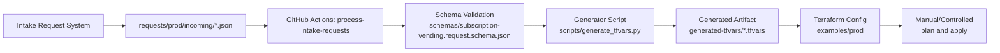

# ALZ Terraform Subscription Vending Demo

This repository demonstrates a request-driven subscription vending flow for Azure Landing Zones using the Terraform AVM module `Azure/avm-ptn-alz-sub-vending/azure`.

It includes:

- A request schema for intake validation
- A production intake drop zone for incoming JSON requests
- A generator script that validates request payloads and emits `terraform.tfvars`
- A GitHub Actions workflow that processes incoming request files and publishes generated artifacts
- A Terraform example for the production landing zone vending configuration

## Repository layout

- `requests/prod/incoming/`
  - Drop zone for approved production request JSON files from your intake system.
- `requests/request.prod.example.json`
  - Example request payload.
- `schemas/subscription-vending.request.schema.json`
  - Request validation schema.
- `scripts/generate_tfvars.py`
  - Validates request JSON and generates `examples/prod/terraform.tfvars`.
- `scripts/README.md`
  - Script usage and examples.
- `examples/prod/`
  - Terraform implementation using `terraform-lz-vending` module.
- `.github/workflows/process-intake-requests.yml`
  - Workflow that detects intake file changes and generates tfvars artifacts.

## Intake process

1. Intake/request system writes one approved JSON file to `requests/prod/incoming/`.
2. GitHub Actions workflow `process-intake-requests` detects changed request files.
3. The workflow runs `scripts/generate_tfvars.py` with the schema in `schemas/`.
4. Generated tfvars files are uploaded as the `generated-tfvars` workflow artifact.
5. Terraform plan/apply can then be executed from `examples/prod` (manually or in a controlled deployment workflow).

## Architecture diagram



## Local quick start

### 1) Generate tfvars from a request

```powershell
python .\scripts\generate_tfvars.py `
  --schema .\schemas\subscription-vending.request.schema.json `
  --request .\requests\request.prod.example.json `
  --out .\examples\prod\terraform.tfvars
```

### 2) Validate Terraform configuration

```powershell
terraform -chdir=examples/prod init -backend=false
terraform -chdir=examples/prod validate
```

## GitHub Actions quick test

1. Add a test request file in `requests/prod/incoming/`.
2. Commit and push.
3. Confirm workflow run for `.github/workflows/process-intake-requests.yml` succeeds.
4. Download `generated-tfvars` artifact and verify output.

## Notes

- Keep one request per file in the intake drop zone.
- Avoid secrets in request payloads; use IDs/references.
- The current workflow generates and validates inputs, but does not auto-apply Terraform.
